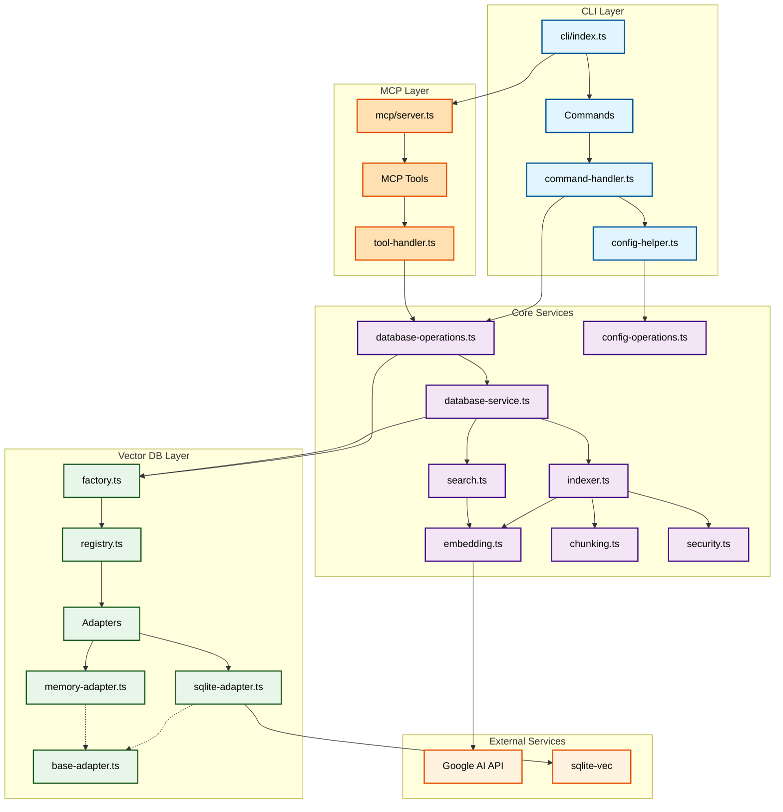

# Gistdex - Pluggable Vector Database Architecture

[](https://www.npmjs.com/package/@ushironoko/gistdex)
[](https://opensource.org/licenses/MIT)

RAG (Retrieval-Augmented Generation) search system with pluggable vector database support.

## Features

### 🔌 Pluggable Vector Database Architecture

- **Abstract Interface**: Common interface for all vector database implementations
- **Multiple Adapters**: Support for different vector databases
  - SQLite (built-in) - Local, file-based storage
  - Memory (built-in) - In-memory storage for testing
  - Custom adapters - Extend with your own implementations
- **Easy Migration**: Switch between databases without changing application code
- **Configuration-based**: Select database via configuration file or environment variables

### 🔍 Smart Content Retrieval

- **Efficient Chunking**: Small chunks (default 1000 chars) for precise search
- **Full Content Recovery**: Automatically retrieves complete original content with `--full` flag
- **Source Tracking**: Each chunk is linked to its original source via unique IDs
- **Overlap Management**: Intelligent overlap handling when reconstructing content

## Requirements

- Node.js >= 24.6.0 (Required to avoid ExperimentalWarning from node:sqlite)
- Google AI API key for embeddings

## Installation

### Global Installation

```bash
npm add -g @ushironoko/gistdex
```

### Local Installation

```bash
npm add @ushironoko/gistdex
```

### Direct Usage (without installation)

```bash
npx @ushironoko/gistdex init
```

## Setup

## Initialize Gistdex

Run the initialization command to set up Gistdex:

```bash
npx @ushironoko/gistdex init
```

This interactive command will:

- Guide you through configuration options
- Generate `.env` for default settings
- Create `gistdex.config.json` with your database preferences
- Initialize the vector database
- Set up necessary tables and indexes

**Note**: Google AI API key should never be stored in `gistdex.config.json`. Always use environment variables or `.env` files for sensitive information.

You can also specify options directly:

```bash
npx @ushironoko/gistdex init --provider memory  # Use in-memory database
npx @ushironoko/gistdex init --provider sqlite --db ./custom-path.db  # Custom SQLite path
```

## Usage

### Index Content

Index a GitHub Gist:

```bash
npx @ushironoko/gistdex index --gist https://gist.github.com/user/abc123
```

Index a GitHub repository:

```bash
npx @ushironoko/gistdex index --github https://github.com/owner/repo --branch main --paths src,docs
```

Index a local file:

```bash
npx @ushironoko/gistdex index --file ./document.md --title "My Document"
```

Index multiple files with glob patterns:

```bash
# Index all TypeScript files in src directory
npx @ushironoko/gistdex index --files "src/**/*.ts"

# Index multiple patterns (comma-separated)
npx @ushironoko/gistdex index --files "src/**/*.ts,docs/**/*.md,*.json"

# Index with custom chunking parameters
npx @ushironoko/gistdex index --files "**/*.md" --chunk-size 2000 --chunk-overlap 200
```

Index plain text:

```bash
npx @ushironoko/gistdex index --text "Your text content here" --title "Text Title"
```

Use specific provider:

```bash
npx @ushironoko/gistdex index --provider memory --file ./test.md
```

### Search

Basic search:

```bash
npx @ushironoko/gistdex query "vector search implementation"
```

Search with full original content:

```bash
# Show full content for each result
npx @ushironoko/gistdex query --full "search query"

# Get single result with full content as raw output
npx @ushironoko/gistdex query -k 1 -f "specific search"
```

Advanced search options:

```bash
# Get more results
npx @ushironoko/gistdex query --top-k 10 "embeddings"

# Filter by source type
npx @ushironoko/gistdex query --type gist "gist content"

# Hybrid search (semantic + keyword)
npx @ushironoko/gistdex query --hybrid "search query"

# Disable re-ranking
npx @ushironoko/gistdex query --no-rerank "exact match"
```

Query options:

- `-k, --top-k <n>`: Number of results (default: 5)
- `-t, --type <type>`: Filter by source type (gist, github, file, text)
- `-y, --hybrid`: Enable hybrid search
- `-n, --no-rerank`: Disable result re-ranking
- `-f, --full`: Show full original source content (not just chunks)

### List Indexed Content

```bash
npx @ushironoko/gistdex list
npx @ushironoko/gistdex list --stats  # Show statistics only
```

### MCP (Model Context Protocol) Server

Gistdex can be used as an MCP server, allowing LLMs to directly index and search content.

#### Starting the MCP Server

```bash
# Start MCP server using the dedicated binary
npx gistdex-mcp

# Or if installed globally
npm install -g @ushironoko/gistdex
gistdex-mcp
```

#### Configuring for Claude Desktop

Add the following configuration to your Claude Desktop's `claude_desktop_config.json`:

```json
{
  "mcpServers": {
    "gistdex": {
      "command": "npx",
      "args": ["--yes", "gistdex-mcp"],
      "cwd": "~/Documents/gistdex-data"
    }
  }
}
```

Or if you have `@ushironoko/gistdex` installed globally:

```json
{
  "mcpServers": {
    "gistdex": {
      "command": "gistdex-mcp",
      "cwd": "~/Documents/gistdex-data"
    }
  }
}
```

**Important**: 
- Set the `cwd` field to specify where the database will be created
- The `--yes` flag ensures npx installs the package without prompting

**Important**: Set the `cwd` field to specify where the database will be created. Without it, the database may be created in Claude Desktop's installation directory.

Recommended paths:

**macOS/Linux:**
- `~/Documents/gistdex-data` - User's Documents folder
- `~/.gistdex` - Hidden folder in home directory
- `/absolute/path/to/project` - Specific project directory

**Windows:**
- `C:\\Users\\%USERNAME%\\Documents\\gistdex-data` - User's Documents folder
- `%USERPROFILE%\\gistdex-data` - User profile directory
- `C:\\gistdex-data` - Root of C drive
- `.\\gistdex-data` - Relative to current directory

Note: On Windows, use double backslashes (`\\`) or forward slashes (`/`) in JSON files.

#### MCP Tools Available

- **gistdex_index**: Index content from various sources (text, file, gist, github)
- **gistdex_query**: Search indexed content with semantic or hybrid search
- **gistdex_list**: List indexed items with optional statistics

### Adapter Information

Show adapter information:

```bash
npx @ushironoko/gistdex info --provider sqlite
```

### Version Information

Show CLI version:

```bash
npx @ushironoko/gistdex version
# or
npx @ushironoko/gistdex --version
# or
npx @ushironoko/gistdex -v
```

## Complete Command Reference

### `init` - Initialize Database

Initialize a new Gistdex project with configuration files and database setup.

```bash
npx @ushironoko/gistdex init [options]
# or
npx @ushironoko/gistdex --init
```

**Options:**

- `--provider <name>` - Vector database provider (default: sqlite)
- `--db <path>` - Database file path for SQLite

### `index` - Index Content

Index content from various sources into the vector database.

```bash
npx @ushironoko/gistdex index [options]
```

**Options:**

- `--provider <name>` - Vector database provider (default: sqlite)
- `--db <path>` - Database file path for SQLite
- `--text <content>` - Index plain text directly
- `--file <path>` - Index a single file (restricted to current directory and subdirectories)
- `--files <patterns>` - Index multiple files using glob patterns (comma-separated)
- `--gist <url>` - Index a GitHub Gist (only gist.github.com URLs allowed)
- `--github <url>` - Index a GitHub repository (only github.com URLs allowed)
- `--title <title>` - Custom title for the indexed content
- `--url <url>` - Custom URL metadata for the indexed content
- `--chunk-size <n>` - Text chunk size in characters (default: 1000)
- `--chunk-overlap <n>` - Overlap between chunks in characters (default: 200)
- `--branch <branch>` - GitHub branch to index (default: main)
- `--paths <paths>` - Comma-separated paths to index from GitHub repository

### `query` - Search Content

Search indexed content using semantic or hybrid search.

```bash
npx @ushironoko/gistdex query [options] <search-query>
```

**Options:**

- `--provider <name>` - Vector database provider (default: sqlite)
- `--db <path>` - Database file path for SQLite
- `-k, --top-k <n>` - Number of results to return (default: 5)
- `-t, --type <type>` - Filter by source type (gist, github, file, text)
- `-y, --hybrid` - Enable hybrid search (combines semantic and keyword matching)
- `-n, --no-rerank` - Disable result re-ranking
- `-f, --full` - Show full original source content instead of chunks

### `list` - List Indexed Items

Display all indexed items with their metadata.

```bash
npx @ushironoko/gistdex list [options]
```

**Options:**

- `--provider <name>` - Vector database provider (default: sqlite)
- `--db <path>` - Database file path for SQLite
- `--stats` - Show statistics only (total items, items by type)

### `info` - Database Information

Show information about the current vector database adapter.

```bash
npx @ushironoko/gistdex info [options]
```

**Options:**

- `--provider <name>` - Vector database provider (default: sqlite)

### `version` - Show Version

Display the CLI version.

```bash
npx @ushironoko/gistdex version
# Aliases:
npx @ushironoko/gistdex --version
npx @ushironoko/gistdex -v
```

### `help` - Show Help

Display help information for all commands.

```bash
npx @ushironoko/gistdex help
# or
npx @ushironoko/gistdex --help
# or
npx @ushironoko/gistdex -h
```

## Architecture Diagram

The following diagram illustrates the relationships between key modules in the Gistdex architecture:



### Module Relationships Explained

#### CLI Layer

- **cli/index.ts**: Main entry point that uses gunshi framework for command routing
- **Commands**: Individual command handlers (init, index, query, list, info, version, help)
- **command-handler.ts**: Abstracts common database operations for all commands
- **config-helper.ts**: Handles configuration loading and merging from multiple sources

#### MCP Layer (Model Context Protocol)

- **mcp/server.ts**: MCP server implementation using StdioServerTransport
- **MCP Tools**: Three tools available via MCP protocol:
  - `gistdex_index`: Index content from various sources
  - `gistdex_query`: Search indexed content with semantic/hybrid search
  - `gistdex_list`: List indexed items with statistics
- **tool-handler.ts**: Common factory for creating type-safe tool handlers

#### Core Services

- **database-operations.ts**: Provides functional composition patterns (`withDatabase`, `withReadOnly`)
- **database-service.ts**: Main service orchestrating all database operations
- **config-operations.ts**: Manages configuration from files, environment, and CLI arguments
- **indexer.ts**: Handles content indexing from various sources (Gist, GitHub, files, text)
- **search.ts**: Implements semantic and hybrid search algorithms
- **embedding.ts**: Generates vector embeddings using Google AI
- **chunking.ts**: Splits content into overlapping chunks for indexing
- **security.ts**: Validates file paths and URLs for security

#### Core Utilities

- **env-loader.ts**: Common environment variable loader with fallback to system environment
- **ranking.ts**: Result re-ranking algorithms for search optimization
- **config-parser.ts**: Configuration parsing and validation utilities

#### Vector DB Layer

- **factory.ts**: Creates adapter instances based on configuration
- **registry.ts**: Manages registration of available adapters
- **Adapters**: Interface implemented by all database adapters
- **sqlite-adapter.ts**: SQLite with sqlite-vec extension for local storage
- **memory-adapter.ts**: In-memory storage for testing
- **base-adapter.ts**: Shared functionality for adapters

#### Data Flow

1. CLI commands receive user input
2. CommandHandler abstracts database connection management
3. DatabaseOperations provides scoped database access
4. DatabaseService coordinates between adapters and business logic
5. Adapters handle actual data persistence
6. External services (Google AI, sqlite-vec) provide specialized functionality

## Programmatic Usage

```typescript
import {
  createDatabaseService,
  createFactory,
  withRegistry,
  semanticSearch,
  indexText,
  createConfigOperations,
} from "@ushironoko/gistdex";

// Option 1: Using database operations (recommended)
import { createDatabaseOperations } from "@ushironoko/gistdex";

const operations = createDatabaseOperations({
  provider: "sqlite",
  options: {
    path: "./my-db.db",
    dimension: 768,
  },
});

await operations.withDatabase(async (service) => {
  // Index content
  await indexText(
    "Your content here",
    {
      title: "Document Title",
      sourceType: "text",
    },
    {},
    service,
  );

  // Search
  const results = await semanticSearch("query", {}, service);
});

// Option 2: Using configuration operations
const configOps = createConfigOperations();
const config = await configOps.load(); // Load from file/env
const dbConfig = await configOps.getVectorDBConfig();

const operations = createDatabaseOperations(dbConfig);
// Use operations...

// Option 3: Manual service management
await withRegistry(async (registry) => {
  const factory = createFactory(registry);
  const service = createDatabaseService(factory);

  await service.initialize({
    provider: "sqlite",
    options: { path: "./my-db.db" },
  });

  // Use service...

  await service.close();
});
```

## Creating Custom Adapters

## Adapter Development Guide

See `templates/adapter-template.ts` for a complete template to create your own adapter.

### Method 1: For CLI Usage (Configuration-based)

To use custom adapters with the CLI, add them to your `gistdex.config.json`:

```json
{
  "vectorDB": {
    "provider": "pinecone",
    "options": {
      "environment": "us-east1-gcp",
      "index": "gistdex"
    }
  },
  "customAdapters": {
    "pinecone": "./adapters/pinecone-adapter.js"
  }
}
```

Then use the CLI normally:

```bash
# The adapter specified in config will be used automatically
npx @ushironoko/gistdex index --file document.txt
npx @ushironoko/gistdex query "search query"

# Or override with --provider option
npx @ushironoko/gistdex info --provider pinecone
```

### Method 2: For Programmatic Usage (withCustomRegistry)

Use `withCustomRegistry` for scoped, isolated usage in code:

```typescript
import { withCustomRegistry, createFactory, createDatabaseService } from "@ushironoko/gistdex";
import { createPineconeAdapter } from "./pinecone-adapter";

// Use custom adapter in an isolated scope
await withCustomRegistry(
  new Map([["pinecone", createPineconeAdapter]]),
  async (registry) => {
    const factory = createFactory(registry);
    const service = createDatabaseService(factory);

    await service.initialize({
      provider: "pinecone",
      options: {
        apiKey: "your-key",
        environment: "us-east1-gcp",
        index: "gistdex"
      },
    });

    // Use the service
    await service.saveItem({
      content: "Example content",
      embedding: [0.1, 0.2, ...],
      metadata: { title: "Example" }
    });

    const results = await service.searchSimilar([0.1, 0.2, ...], { k: 5 });

    await service.close();
  },
);
```

### Required Methods

Each adapter factory function must return an object implementing these methods:

- `initialize()` - Set up connections
- `insert()` - Add single document
- `insertBatch()` - Add multiple documents
- `search()` - Vector similarity search
- `update()` - Update document
- `delete()` - Remove document
- `deleteBatch()` - Remove multiple documents
- `get()` - Retrieve by ID
- `count()` - Count documents
- `list()` - List with pagination
- `close()` - Clean up resources
- `getInfo()` - Return adapter information (provider, version, capabilities)

### Factory Functions

Adapters are created using factory functions that:

1. Accept a `VectorDBConfig` parameter
2. Return a `Promise<VectorDBAdapter>`
3. Handle async initialization and resource setup
4. Return an object implementing all required methods

**Important**: Export your adapter using one of these patterns:

- Named export as `createAdapter`: `export { createYourAdapter as createAdapter }`
- Default export: `export default createYourAdapter`

### Supported Adapters

| Adapter | Status      | Description              | Use Case                            |
| ------- | ----------- | ------------------------ | ----------------------------------- |
| SQLite  | ✅ Built-in | Local file-based storage | Development, small-scale production |
| Memory  | ✅ Built-in | In-memory storage        | Testing, temporary data             |

## Development

Run tests:

```bash
pnpm test
pnpm run test:watch
pnpm run test:coverage
```

Linting and formatting:

```bash
pnpm run lint
pnpm run format
pnpm run tsc
```

## License

MIT
